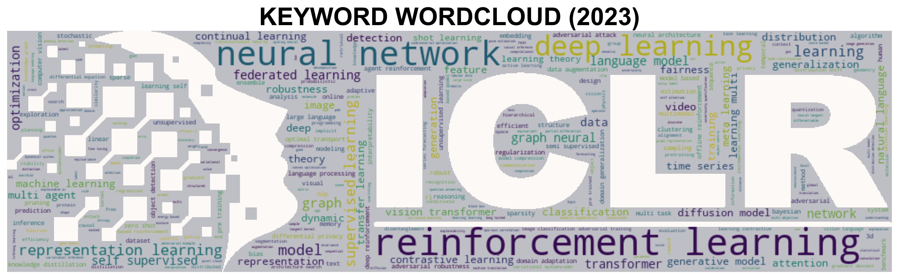
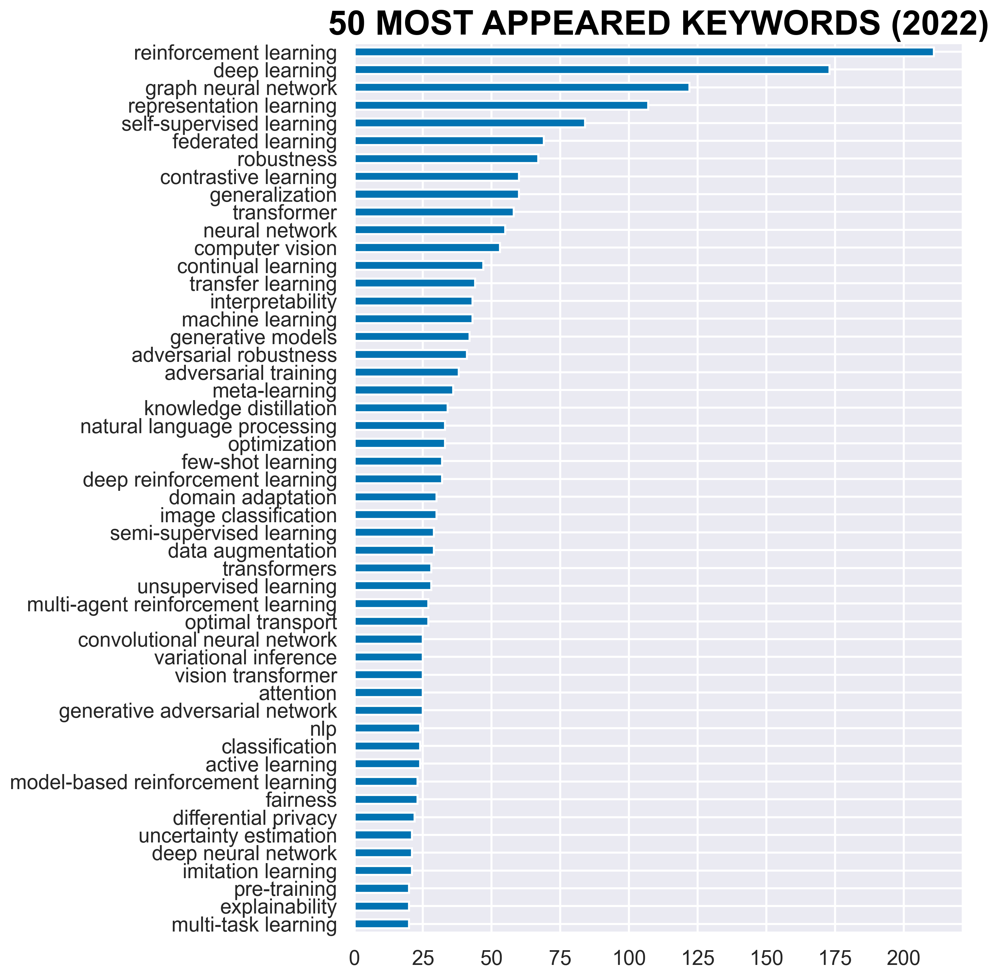
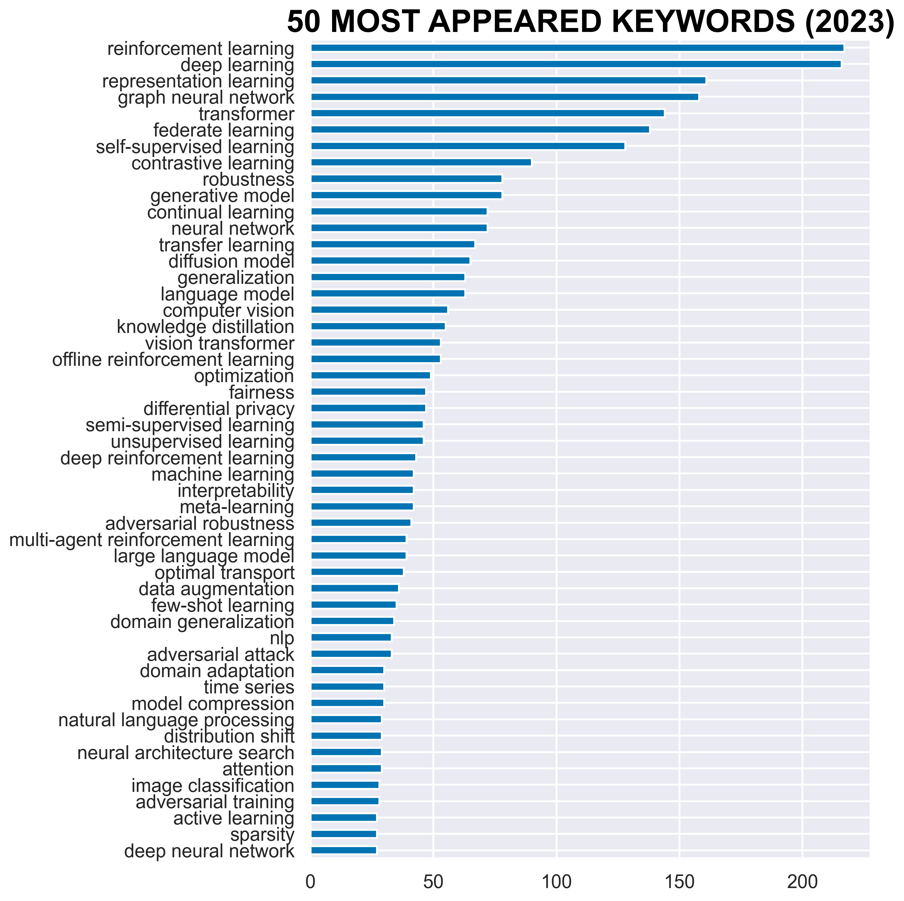
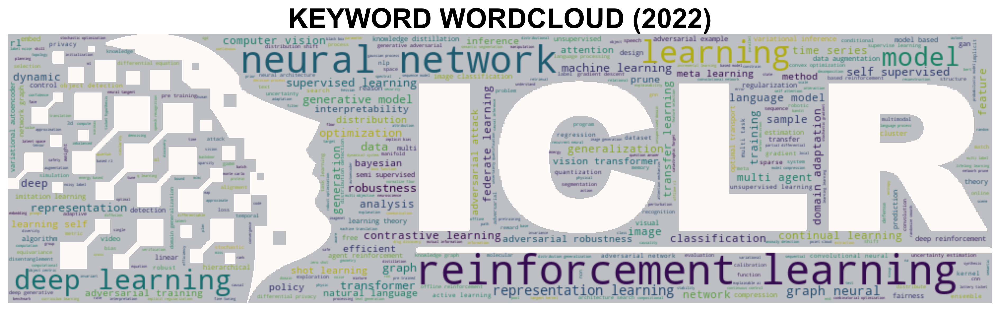
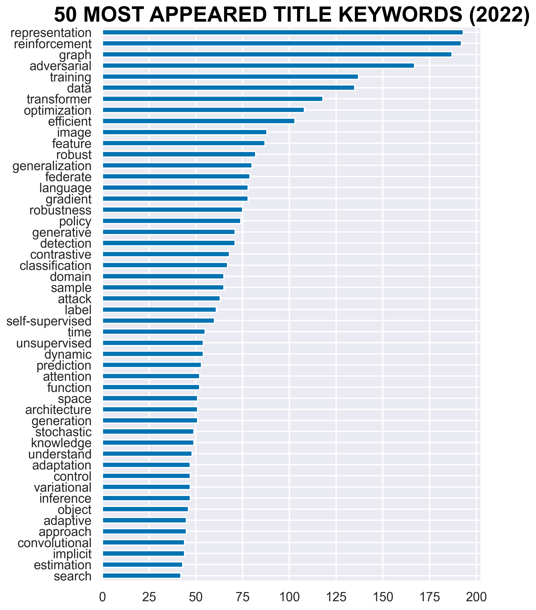
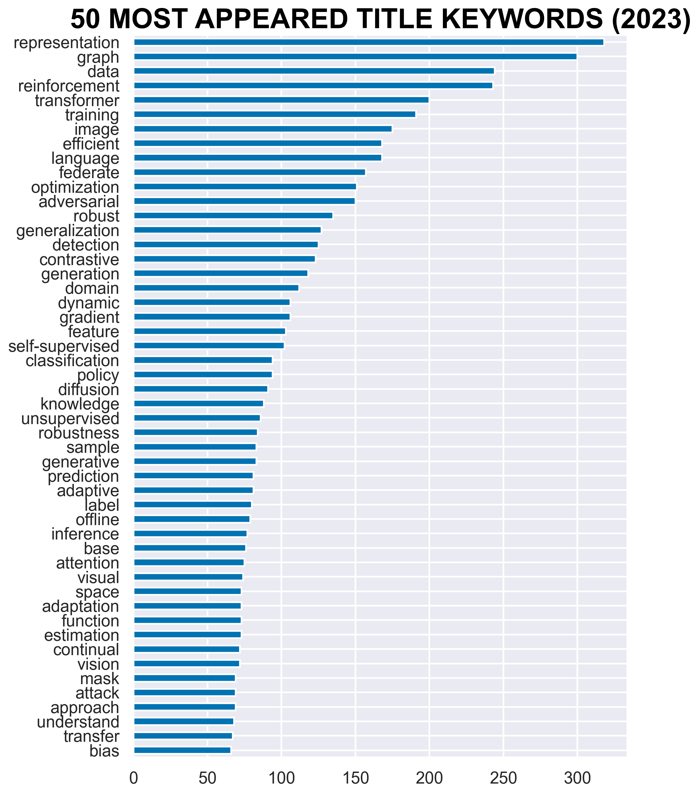
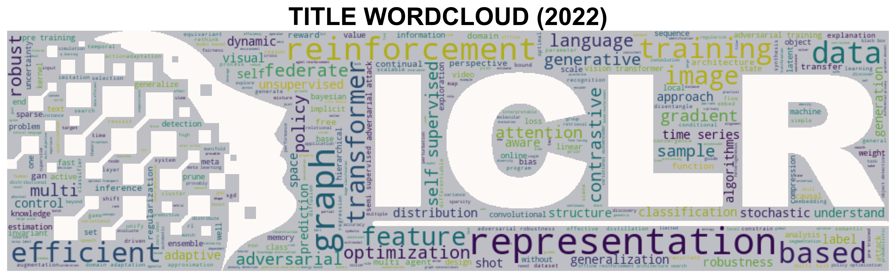
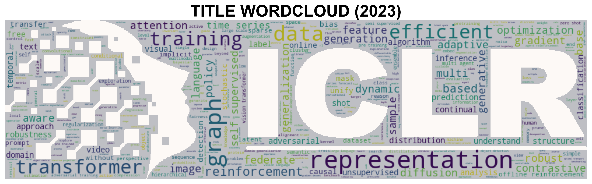

# Visualize ICLR 2023 OpenReview Data

ICLR 2023 Paper submission analysis from https://openreview.net/group?id=ICLR.cc/2023/Conference

<p align="center">
    
</p>

## Requirements
+ Install requirements
```bash
pip install wordcloud nltk pandas imageio selenium tqdm
```
+ Download several `nltk`-related packages for language processing
```python
import nltk
nltk.download('punkt')
nltk.download('averaged_perceptron_tagger')
nltk.download('wordnet')
nltk.download('stopwords')

```
+ If you got anything wrong when calling `webdriver.Edge('msedgedriver.exe')`, you can 

    - Delete `msedgedriver.exe` since it may only work on my computer (Windows 10)

    - [*Install Microsoft Edge (Chromium)*](https://docs.microsoft.com/en-us/microsoft-edge/webdriver-chromium?tabs=python#install-microsoft-edge-chromium): *Ensure you have installed [Microsoft Edge (Chromium)](https://www.microsoft.com/en-us/edge). To confirm that you have Microsoft Edge (Chromium) installed, go to `edge://settings/help` in the browser, and verify the version number is Version 75 or later*.
    - *Download Microsoft Edge Driver*: *Go to `edge://settings/help` to get the version of Edge.*
    - *Navigate to the [Microsoft Edge Driver downloads](https://developer.microsoft.com/microsoft-edge/tools/webdriver/#downloads) page and download the driver that matches the  Edge version number.*

   > From https://stackoverflow.com/questions/63529124/how-to-open-up-microsoft-edge-using-selenium-and-python

## Crawl Data
1. Run `crawl_paperlist.py` to crawl the list of papers (~0.5h).
```bash
python crawl_paperlist.py --year 2023
```

## Paper List
`crawl_paperlist.py` will miss several papers for some errors. The *full* paper list are as follows:

+ Year 2022 (3,407 submissions in total):

  + [sources/ICLR-2022.csv](./sources/ICLR-2022.csv)

  + [sources/ICLR-2022.md](./sources/ICLR-2022.md)

+ Year 2023  (4,966 submissions in total):

  + [sources/ICLR-2023.csv](./sources/ICLR-2023.csv)

  + [sources/ICLR-2023.md](./sources/ICLR-2023.md)


## Visualization
Keywords and Title

+ **Keywords Frequency**
The top 50 common keywords (uncased) and their frequency:

<p align="center">
    
</p>

+ **Top-10 Ranking between 2022 and 2023** (full list please refer to [keywords.md](./keywords.md))

| Keyword                  |   2022 |   2023 |
|:-------------------------|-------:|-------:|
| reinforcement learning   |      1 |      1 |
| deep learning            |      2 |      2 |
| representation learning  |      4 |      3 |
| graph neural network     |      3 |      4 |
| transformer              |      5 |      5 |
| federate learning        |      7 |      6 |
| self-supervised learning |      6 |      7 |
| contrastive learning     |     10 |      8 |
| robustness               |      9 |      9 |
| generative model         |      8 |     10 |

+ **Ranking Changes of Top-50 keywords**

| Keywords                       | 2022 | 2023 | rank $\uparrow$ |
| :----------------------------- | ---: | ---: | -------------:  |
| large language model           |  208 |   32 |            176  |
| diffusion model                |  173 |   14 |            159  |
| offline reinforcement learning |   59 |   20 |             39  |
| sparsity                       |   85 |   49 |             36  |
| adversarial training           |   19 |   47 |            -28  |
| differential privacy           |   45 |   23 |             22  |
| fairness                       |   43 |   22 |             21  |
| model compression              |   61 |   41 |             20  |
| domain generalization          |   55 |   36 |             19  |
| time series                    |   58 |   40 |             18  |


+ **Keywords Cloud**
The word clouds formed by keywords of submissions show the hot topics including *deep learning*, *reinforcement learning*, *representation learning*, *graph neural network*, etc.

<p align="center">
    
</p>


+ **Title Keywords Frequency**
The top 50 common title keywords (uncased) and their frequency:

<p align="center">
    
</p>

+ **Top-10 Ranking between 2022 and 2023** (full list please refer to [title.md](./title.md))

| Title          |   2022 |   2023 |
|:---------------|-------:|-------:|
| representation |      1 |      1 |
| graph          |      3 |      2 |
| data           |      6 |      3 |
| reinforcement  |      2 |      4 |
| transformer    |      7 |      5 |
| training       |      5 |      6 |
| image          |     10 |      7 |
| efficient      |      9 |      8 |
| language       |     15 |      9 |
| federate       |     14 |     10 |

+ **Ranking Changes of Top-50 Title keywords**

| Title      | 2022 | 2023 | rank $\uparrow$ |
| :--------- | ---: | ---: | -------------:  |
| mask       |  325 |   45 |            280  |
| diffusion  |  132 |   25 |            107  |
| base       |   76 |   36 |             40  |
| visual     |   61 |   38 |             23  |
| offline    |   55 |   34 |             21  |
| attack     |   25 |   46 |            -21  |
| vision     |   64 |   44 |             20  |
| generation |   36 |   17 |             19  |
| adaptive   |   45 |   32 |             13  |
| knowledge  |   38 |   26 |             12  |

+ **Title Keywords Cloud**
The word clouds formed by keywords of submission titles:

<p align="center">
    
</p>


## Related projects
+ https://github.com/evanzd/ICLR2021-OpenReviewData
+ https://github.com/fedebotu/ICLR2022-OpenReviewData
+ https://github.com/EdisonLeeeee/ICLR2022-OpenReviewData

